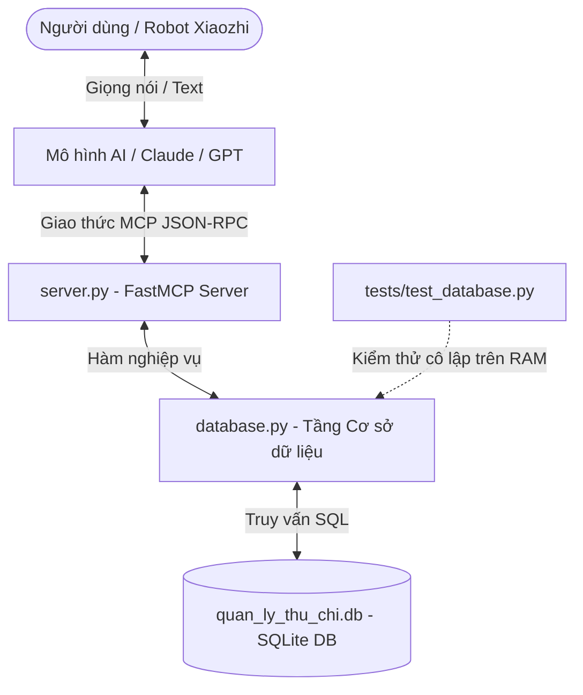

# HƯỚNG DẪN GIẢI THÍCH CHI TIẾT CODE & TÍNH NĂNG DỰ ÁN
## XIAOZHI FINANCE MCP SERVER (QUẢN LÝ TÀI CHÍNH CÁ NHÂN)

Tài liệu này giải thích chi tiết cấu trúc thư mục, chức năng của từng file, thuật toán nghiệp vụ, và cách thức hoạt động của hệ thống máy chủ Model Context Protocol (MCP) quản lý tài chính cá nhân.

---

## I. TỔNG QUAN KIẾN TRÚC DỰ ÁN

Dự án được tổ chức theo kiến trúc phân lớp rõ ràng:


* **`database.py`:** Tầng quản lý cơ sở dữ liệu (SQLite), thực hiện các tác vụ khởi tạo bảng, truy vấn, chèn dữ liệu, đối sánh ngân sách và xử lý múi giờ.
* **`server.py`:** Tầng giao diện MCP Server, khai báo các công cụ (Tools) phục vụ Robot/LLM và cấu hình hệ thống ghi nhật ký (Logging).
* **`tests/test_database.py`:** Bộ kiểm thử tự động (Unit Test) cho tất cả các nghiệp vụ dưới tầng cơ sở dữ liệu.
* **`server.log`:** File lưu vết lịch sử hoạt động của server và các phản hồi văn bản (TTS).

---

## II. CHI TIẾT TẦNG CƠ SỞ DỮ LIỆU (`database.py`)

File này xử lý toàn bộ tương tác trực tiếp với cơ sở dữ liệu SQLite `quan_ly_thu_chi.db`.

### 1. Khởi tạo Cơ sở dữ liệu (`init_db`)
Hàm tạo ra hai bảng nếu chúng chưa tồn tại:
* **Bảng `thu_chi_logs`:** Lưu lịch sử các giao dịch.
  * `id`: Khóa chính tự động tăng (`INTEGER PRIMARY KEY AUTOINCREMENT`).
  * `type`: Loại giao dịch (`TEXT`), bắt buộc là `thu` (thu nhập) hoặc `chi` (chi tiêu).
  * `amount`: Số tiền giao dịch (`REAL`).
  * `category`: Hạng mục phân loại (`TEXT`), ví dụ: *Ăn uống, Di chuyển*.
  * `description`: Ghi chú chi tiết (`TEXT`).
  * `created_at`: Thời gian ghi nhận (`TIMESTAMP`), mặc định là thời gian hiện tại.
  * **Tối ưu hóa:** Tạo chỉ mục `idx_thu_chi_logs_created_at` trên cột `created_at` để cải thiện hiệu năng lọc giao dịch theo thời gian.
* **Bảng `ngan_sach`:** Lưu hạn mức ngân sách tháng của từng danh mục.
  * `category`: Hạng mục làm khóa chính (`TEXT PRIMARY KEY`), đảm bảo một danh mục chỉ có một hạn mức ngân sách duy nhất.
  * `amount`: Số tiền hạn mức tối đa trong tháng (`REAL`).

### 2. Quản lý Múi giờ Việt Nam (`get_date_range` & `insert_giao_dich`)
* Cơ sở dữ liệu mặc định của SQLite sử dụng giờ UTC. Để báo cáo chính xác thời gian tại Việt Nam, hệ thống sử dụng múi giờ `UTC+7` thông qua đối tượng `timezone(timedelta(hours=7))`.
* Khi chèn giao dịch (`insert_giao_dich`), nếu không truyền vào thời gian cụ thể, hệ thống sẽ tự động lấy thời gian hiện tại theo múi giờ Việt Nam định dạng `YYYY-MM-DD HH:MM:SS`.
* Hàm `get_date_range(time_range)` tính toán mốc thời gian bắt đầu và kết thúc theo ngày hiện hành của Việt Nam:
  * **`today`:** Từ `00:00:00` đến `23:59:59` của ngày hôm nay.
  * **`yesterday`:** Từ `00:00:00` đến `23:59:59` của ngày hôm qua.
  * **`this_week`:** Từ thứ Hai tuần này đến thời điểm hiện tại.
  * **`this_month`:** Từ ngày đầu tiên của tháng hiện tại đến ngày hiện tại.

### 3. Nghiệp vụ Hoàn tác (Undo) và Cập nhật
* **`delete_last_transaction`:** Lấy giao dịch có `id` lớn nhất (gần nhất) và thực hiện xóa khỏi bảng `thu_chi_logs`. Đây là tính năng hoàn tác (Undo) rất quan trọng khi trợ lý giọng nói nghe nhầm dữ liệu.
* **`update_giao_dich`:** Cho phép cập nhật linh hoạt một hoặc nhiều trường của giao dịch theo ID cụ thể. Nếu truyền vào `transaction_id = -1`, hệ thống sẽ tự động tìm giao dịch mới nhất để sửa.

### 4. Thuật toán Đối sánh Danh mục Tương đối (Fuzzy Matching)
Khi người dùng nói tự nhiên, họ thường nói thêm các từ mô tả chi tiết (ví dụ: *"Ăn trưa phở bò"*), trong khi danh mục ngân sách đăng ký chỉ là *"Ăn uống"*. Hệ thống giải quyết bài toán này qua hai hàm:

* **Hàm `is_category_match(cat1, cat2)`:**
  1. Chuyển hai chuỗi về chữ thường và loại bỏ khoảng trắng thừa.
  2. Nếu trùng khớp hoàn toàn hoặc chuỗi này chứa chuỗi kia thì xác nhận khớp.
  3. Nếu không, hệ thống tiến hành loại bỏ các **từ dừng (stop-words)** tiếng Việt phổ biến: *và, cho, của, tại, ở, bằng, với, các, những, để*.
  4. Tách các từ còn lại có độ dài từ 2 ký tự trở lên thành tập hợp từ khóa (set).
  5. Tính toán giao tập hợp (set intersection). Nếu có từ khóa chung (ví dụ: *Ăn*), hệ thống xác nhận trùng khớp danh mục.
* **Hàm `find_matching_budget(category)`:** Duyệt qua tất cả các danh mục ngân sách đã lưu trong bảng `ngan_sach`. Ưu tiên so khớp chính xác trước, nếu không tìm thấy sẽ sử dụng hàm `is_category_match` để khớp tương đối.

---

## III. CHI TIẾT TẦNG MCP SERVER (`server.py`)

File này đóng vai trò là "bộ não" giao tiếp trực tiếp với Robot hoặc các mô hình ngôn ngữ lớn (LLM).

### 1. Cấu hình Logging Production
Hệ thống sử dụng `logging` để ghi nhật ký hoạt động đồng thời ra hai kênh:
1. Ghi ra file `server.log` mã hóa UTF-8 để lưu vết lâu dài.
2. Xuất trực tiếp ra dòng thông tin (stdout/stderr) để Robot hoặc developer tiện theo dõi trạng thái.

### 2. Khởi tạo MCP Server
```python
mcp = FastMCP("xiaozhi-finance-mcp")
```
Dòng lệnh này khởi tạo máy chủ MCP sử dụng thư viện FastMCP của Python.

### 3. Giải thích Bộ 7 Công cụ (MCP Tools)

Mỗi công cụ được khai báo bằng decorator `@mcp.tool()` đi kèm Docstring mô tả mục đích sử dụng. Mô tả này là thông tin cấu hình cực kỳ quan trọng để mô hình AI nhận diện khi nào cần kích hoạt công cụ.

#### 🛠️ Tool 1: Ghi nhận thu chi (`ghi_nhan_thu_chi`)
* **Mục đích:** Ghi nhận giao dịch và kiểm soát ngân sách.
* **Cơ chế hoạt động:**
  1. Kiểm tra tính hợp lệ của tham số: loại giao dịch chỉ được là `thu`/`chi`, số tiền phải > 0.
  2. Ghi nhận giao dịch vào DB qua hàm `insert_giao_dich`.
  3. Nếu là giao dịch **chi**, kích hoạt kiểm tra ngân sách tháng:
     * Dùng thuật toán Fuzzy Matching tìm ngân sách tương ứng.
     * Tính tổng chi tiêu tháng này của danh mục đó qua hàm `get_monthly_spending_for_budget_category`.
     * Nếu tổng chi tiêu vượt hạn mức: Trả về phản hồi đính kèm cảnh báo vượt hạn mức định mức.
     * Nếu tổng chi tiêu đạt từ **80%** đến dưới **100%**: Trả về phản hồi đính kèm cảnh báo nhắc nhở nhẹ nhàng (ví dụ: *"đã đạt 85% hạn mức"*).

#### 📊 Tool 2: Báo cáo thống kê (`thong_ke_thu_chi`)
* **Mục đích:** Báo cáo tổng thu, tổng chi của tài khoản từ trước đến nay.
* **Cơ chế hoạt động:** Gọi hàm `get_summary()` tính tổng doanh số thu và chi trong database để trả về phản hồi định dạng tiền tệ Việt Nam (ví dụ: `2.500.000đ`).

#### 🔄 Tool 3: Hủy giao dịch gần nhất (`huy_giao_dich_gan_nhat`)
* **Mục đích:** Xóa nhanh giao dịch vừa nhập sai (tương đương nút Undo).
* **Cơ chế hoạt động:** Gọi hàm `delete_last_transaction()` để xóa bản ghi cuối cùng trong cơ sở dữ liệu.

#### 🔍 Tool 4: Truy vấn giao dịch (`truy_van_giao_dich`)
* **Mục đích:** Liệt kê danh sách các giao dịch đáp ứng bộ lọc của người dùng.
* **Cơ chế hoạt động:** Gọi hàm `query_giao_dich` với các tham số lọc về loại giao dịch, hạng mục, khoảng thời gian (`today`, `yesterday`, `this_week`, `this_month`, `all`) và số lượng dòng tối đa cần lấy. Trả về danh sách được định dạng dễ đọc.

#### ✏️ Tool 5: Sửa giao dịch (`sua_giao_dich`)
* **Mục đích:** Cập nhật thông tin giao dịch cũ.
* **Cơ chế hoạt động:** Hỗ trợ cập nhật bất kỳ trường thông tin nào (số tiền, danh mục, mô tả...). Nếu không truyền ID (`transaction_id = -1`), hệ thống tự động tìm và cập nhật giao dịch vừa nhập gần nhất.

#### ⚙️ Tool 6: Thiết lập hạn mức chi tiêu (`thiet_lap_han_muc`)
* **Mục đích:** Đặt giới hạn chi tiêu hàng tháng cho một danh mục để làm căn cứ cảnh báo tiêu dùng.
* **Cơ chế hoạt động:** Lưu trữ hoặc cập nhật giá trị hạn mức vào bảng `ngan_sach` thông qua hàm `set_ngan_sach`.

#### 📋 Tool 7: Xem tình hình ngân sách (`xem_ngan_sach`)
* **Mục đích:** Xem báo cáo tổng quát tình hình thực hiện ngân sách của tất cả danh mục đã cài đặt.
* **Cơ chế hoạt động:** Lấy tất cả hạn mức ngân sách đã thiết lập, tính toán số tiền đã chi tiêu thực tế trong tháng hiện hành, từ đó tính ra phần trăm tiêu dùng và số tiền còn lại (hoặc số tiền đã vượt hạn mức) của từng hạng mục.

---

## IV. BỘ KIỂM THỬ TỰ ĐỘNG (`tests/test_database.py`)

Để đảm bảo chất lượng phần mềm đạt chuẩn và không xảy ra lỗi khi sửa đổi mã nguồn, dự án triển khai bộ kiểm thử tự động sử dụng thư viện `pytest`.

* **Cơ chế RAM DB ảo (Fixture `setup_test_db`):**
  ```python
  @pytest.fixture(autouse=True)
  def setup_test_db(tmp_path):
      test_db_path = tmp_path / "test_finance.db"
      database.DB_FILE = str(test_db_path)
      database.init_db()
      yield
  ```
  * `tmp_path` là thư mục tạm an toàn do Pytest tự động tạo ra và dọn dẹp sau khi kiểm thử xong.
  * Trước khi chạy mỗi test case, biến `DB_FILE` của tầng database sẽ tạm thời trỏ sang file database ảo này. Do đó, các hành động thêm, xóa, sửa trong lúc chạy test sẽ **hoàn toàn cô lập** và không ảnh hưởng đến cơ sở dữ liệu thật của người dùng.

* **Các ca kiểm thử tiêu biểu:**
  * `test_insert_giao_dich_thanh_cong`: Đảm bảo chèn giao dịch trả về đúng ID bản ghi tăng dần.
  * `test_get_summary_tinh_toan_chinh_xac`: Đảm bảo tính tổng doanh thu và chi phí chính xác.
  * `test_delete_last_transaction`: Kiểm tra chức năng Undo hoạt động tốt.
  * `test_query_giao_dich_today_filter`: Kiểm tra tính chính xác của các bộ lọc thời gian và hạng mục.
  * `test_update_giao_dich_by_id_and_last`: Kiểm tra sửa giao dịch theo ID cụ thể và sửa giao dịch gần nhất (-1).
  * `test_budget_database_operations`: Kiểm tra toàn bộ hoạt động của ngân sách gồm thiết lập, tìm kiếm so khớp tương đối và tính toán chi tiêu thực tế trong tháng.
