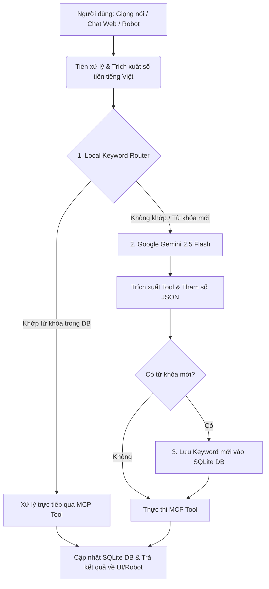

# 🤖 MCP Personal Finance Tool - Trợ Lý Quản Lý Tài Chính Cá Nhân AI & Fast-Path

> **Hệ thống quản lý tài chính cá nhân thông minh ứng dụng giao thức Model Context Protocol (MCP), kết hợp cơ chế định tuyến kép siêu tốc (Local Fast-Path Matcher) và trí tuệ nhân tạo Google Gemini với vòng lặp tự học (Self-Learning Loop).**

---

## 📌 Mục Lục
- [🌟 Điểm Nổi Bật](#-điểm-nổi-bật)
- [🏗️ Kiến Trúc Hệ Thống](#️-kiến-trúc-hệ-thống)
- [🛠️ Danh Sách 7 Công Cụ MCP (MCP Tools)](#️-danh-sách-7-công-cụ-mcp-mcp-tools)
- [💻 Giao Diện Web Visualizer](#-giao-diện-web-visualizer)
- [📁 Cấu Trúc Dự Án](#-cấu-trúc-dự-án)
- [🚀 Hướng Dẫn Cài Đặt & Sử Dụng](#-hướng-dẫn-cài-đặt--sử-dụng)
- [🧪 Chạy Kiểm Thử (Unit Tests)](#-chạy-kiểm-thử-unit-tests)
- [📋 Danh Sách Câu Lệnh Giọng Nói Mẫu](#-danh-sách-câu-lệnh-giọng-nói-mẫu)

---

## 🌟 Điểm Nổi Bật

1. **⚡ Kiến trúc Định tuyến Kép (Dual-Routing Pipeline):**
   - **Fast-Path (Cục bộ)**: Xử lý các câu lệnh quen thuộc thông qua bộ khớp từ khóa tiếng Việt & bóc tách tiếng lóng số tiền (`150k`, `1.5tr`, `2 củ`, `3 lít`, `triệu rưỡi`...). Tốc độ phản hồi cực nhanh (**< 10ms**), hoạt động độc lập và hoàn toàn **miễn phí API**.
   - **Smart-Path (Gemini AI)**: Tự động kích hoạt Google Gemini (`gemini-2.5-flash`) khi gặp câu nói phức tạp, từ lóng mới lạ hoặc thiếu ngữ cảnh.

2. **🧠 Vòng Lặp Tự Học Tự Động (Self-Learning Loop):**
   - Khi Gemini nhận diện thành công một từ khóa/danh mục mới (ví dụ: *"đi bơi"*, *"mua trà sữa"*), hệ thống tự động lưu cặp từ khóa này vào SQLite database.
   - Các lần nhập tiếp theo của người dùng sẽ ngay lập tức được định tuyến qua **Fast-Path cục bộ**, tối ưu hóa chi phí và độ trễ.

3. **📊 Phân Loại Ngân Sách Thông Minh & Cảnh Báo Tự Động:**
   - Tự động map các khoản chi nhỏ về nhóm ngân sách lớn (ví dụ: *"cơm tấm"*, *"bún bò"* $\rightarrow$ ngân sách *"Ăn uống"*).
   - Đưa ra cảnh báo trực quan khi một danh mục chi tiêu chạm ngưỡng **80%** hoặc vượt quá **100%** hạn mức tháng.

4. **🔌 Tương Thích Hoàn Toàn Với Robot & AI Clients (MCP Standard):**
   - Hỗ trợ kết nối tiêu chuẩn qua **Stdio MCP** hoặc **WebSocket Bridge (`mcp_pipe.py`)** để tích hợp trực tiếp vào **Xiaozhi Robot**, Claude Desktop, Cursor hoặc bất kỳ MCP Host nào.

---

## 🏗️ Kiến Trúc Hệ Thống



---

## 🛠️ Danh Sách 7 Công Cụ MCP (MCP Tools)

Tất cả công cụ đều được triển khai theo chuẩn **Model Context Protocol** trong [server.py](file:///d:/mcp-finance-tool/server.py):

| STT | Tên Tool | Mô Tả & Nghiệp Vụ | Tham Số Chính |
|:---:|---|---|---|
| **1** | `ghi_nhan_thu_chi` | Ghi nhận một khoản chi tiêu hoặc thu nhập mới | `transaction_type` ("thu"/"chi"), `amount`, `category`, `description`, `keyword` |
| **2** | `thong_ke_thu_chi` | Thống kê tổng thu, tổng chi và số dư còn lại | *(Không có)* |
| **3** | `thiet_lap_han_muc` | Cài đặt hạn mức chi tiêu hàng tháng cho danh mục | `category`, `amount`, `keyword` |
| **4** | `xem_ngan_sach` | Báo cáo tiến độ chi tiêu & hạn mức ngân sách các mục | *(Không có)* |
| **5** | `truy_van_giao_dich` | Truy vấn và lọc danh sách giao dịch theo thời gian/mục | `transaction_type`, `category`, `time_range`, `limit` |
| **6** | `sua_giao_dich` | Chỉnh sửa giao dịch đã ghi (theo ID hoặc gần nhất) | `transaction_id` (-1 là gần nhất), `amount`, `category`, `description` |
| **7** | `huy_giao_dich_gan_nhat`| Hoàn tác / Hủy khoản giao dịch vừa ghi nhận | *(Không có)* |

---

## 💻 Giao Diện Web Visualizer

Dự án tích hợp sẵn một Dashboard Web hiện đại (**Glassmorphism Dark Theme**) cung cấp:
- **Tổng quan tài chính**: Thẻ hiển thị Tổng thu, Tổng chi, Số dư ví theo thời gian thực.
- **Biểu đồ trực quan**: Cơ cấu chi tiêu theo danh mục (Pie/Doughnut Chart) và ngân sách hạn mức (Progress Bars).
- **Trình giả lập Chat / Voice AI**: Test câu lệnh tự nhiên, quan sát trực tiếp luồng định tuyến Fast-Path vs Gemini Smart-Path cùng các bản ghi JSON-RPC MCP.
- **Quản lý danh mục & từ khóa**: Giao diện thêm/sửa/xóa bộ từ khóa tự học của hệ thống.

---

## 📁 Cấu Trúc Dự Án

```plaintext
mcp-finance-tool/
├── database.py              # Xử lý SQLite: thu_chi_logs, ngan_sach, keywords_mapping
├── server.py                # Máy chủ FastMCP chứa 7 công cụ chuẩn MCP
├── mcp_pipe.py              # Cầu nối Stdio <-> WebSocket cho Xiaozhi Robot
├── requirements.txt         # Danh sách thư viện phụ thuộc của dự án
├── .env.example             # Mẫu cấu hình biến môi trường
├── ROBOT_COMMANDS.md        # Bộ câu lệnh giọng nói mẫu tiếng Việt
├── README.md                # Tài liệu hướng dẫn dự án
│
├── web/                     # Web Dashboard & Backend Visualizer
│   ├── backend.py           # FastAPI server cung cấp RESTful APIs
│   ├── run.py               # Script khởi động Web Server nhanh
│   ├── gemini_parser.py     # Parser xử lý fallback qua Gemini AI
│   ├── keyword_parser.py    # Parser bóc tách số tiền & từ khóa cục bộ
│   ├── test_backend.py      # Unit tests cho Web API
│   └── static/              # Giao diện Frontend (HTML5, Vanilla CSS3, JS)
│       ├── index.html
│       ├── style.css
│       └── app.js
│
└── tests/                   # Bộ kiểm thử tự động toàn diện
    ├── test_database.py
    ├── test_server.py
    ├── test_keyword_router.py
    ├── test_keyword_parser.py
    ├── test_keyword_db.py
    ├── test_keyword_api.py
    ├── test_dynamic_category.py
    └── test_llm_budget_fallback.py
```

---

## 🚀 Hướng Dẫn Cài Đặt & Sử Dụng

### 1. Yêu cầu hệ thống
- **Python**: Phiên bản `3.11` trở lên
- **Google Gemini API Key**: [Lấy miễn phí tại Google AI Studio](https://aistudio.google.com/)

### 2. Cài đặt môi trường
Clone mã nguồn và cài đặt các thư viện phụ thuộc:
```bash
git clone https://github.com/iamjuly205/mcp-finance-tool.git
cd mcp-finance-tool

# Khởi tạo và kích hoạt virtual environment (khuyến nghị)
python -m venv venv
# Trên Windows:
venv\Scripts\activate
# Trên Linux/macOS:
source venv/bin/activate

# Cài đặt thư viện
pip install -r requirements.txt
```

### 3. Cấu hình biến môi trường
Sao chép file `.env.example` thành `.env` và điền API Key:
```bash
cp .env.example .env
```
Mở file `.env` và cập nhật:
```env
GEMINI_API_KEY=your_gemini_api_key_here
```

### 4. Khởi chạy ứng dụng

#### 👉 Chạy Web Dashboard & API (FastAPI)
```bash
python web/run.py
```
*Truy cập giao diện Web tại*: `http://localhost:8000`

#### 👉 Chạy trực tiếp MCP Server (Stdio Mode)
```bash
python server.py
```

#### 👉 Chạy cầu nối WebSocket cho Robot Xiaozhi
```bash
python mcp_pipe.py server.py
```

---

## 🧪 Chạy Kiểm Thử (Unit Tests)

Dự án đi kèm bộ 35 unit test tự động kiểm tra toàn bộ luồng nghiệp vụ:
```bash
pytest --basetemp=./.pytest_temp
```
*Tất cả kiểm thử trong `tests/` và `web/test_backend.py` sẽ được thực thi để đảm bảo tính toàn vẹn của mã nguồn.*

---

## 📋 Danh Sách Câu Lệnh Giọng Nói Mẫu

Hệ thống xử lý linh hoạt mọi dạng câu nói tự nhiên:
- **Ghi nhận chi tiêu**: *"Hôm nay ăn phở hết 45k"*, *"Vừa đi grab 30 nghìn"*, *"Đổ xăng 50k"*
- **Ghi nhận thu nhập**: *"Nhận lương tháng này 15 triệu"*, *"Được thưởng dự án 2 củ"*
- **Thiết lập hạn mức**: *"Đặt hạn mức ăn uống 3 triệu"*
- **Xem ngân sách & Báo cáo**: *"Xem ngân sách tháng này"*, *"Thống kê thu chi"*
- **Hoàn tác & Sửa đổi**: *"Hủy giao dịch vừa rồi"*, *"Sửa khoản gần nhất thành 40k"*

*(Xem thêm danh sách đầy đủ tại [ROBOT_COMMANDS.md](file:///d:/mcp-finance-tool/ROBOT_COMMANDS.md))*

---

## 📄 Bản Quyền & Đóng Góp
Dự án được xây dựng phục vụ nhu cầu quản lý chi tiêu thông minh trên nền tảng MCP. Mọi đóng góp và phản hồi đều được hoan nghênh!
