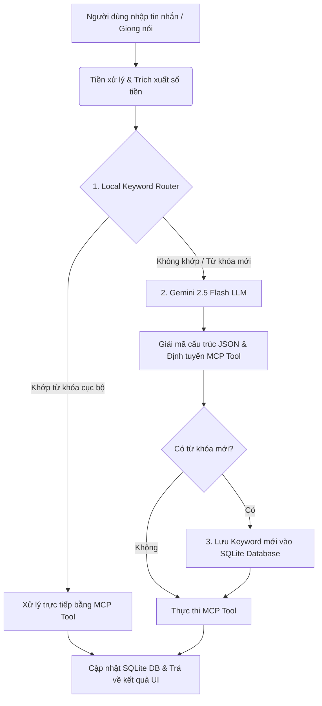

# 🤖 MCP Personal Finance Tool - Trợ Lý Tài Chính Thông Minh (AI & Local Keyword Fast-Path)

Ứng dụng quản lý tài chính cá nhân thông minh kết hợp giữa **Model Context Protocol (MCP)**, **Engine phân loại từ khóa cục bộ siêu tốc (Local Keyword Matcher)** và **Gemini AI LLM với khả năng tự học (Self-Learning Loop)**.

---

## 🌟 1. Điểm Nổi Bật & Công Nghệ Sử Dụng

### 🛠️ Công Nghệ Cốt Lõi (Tech Stack)
* **Backend Framework**: Python 3.11+ / FastAPI (RESTful API & Web Server)
* **AI & MCP Standard**: Model Context Protocol (FastMCP Framework), Google Gemini API (`gemini-2.5-flash`)
* **Database**: SQLite3 (Quản lý nhật ký thu chi `thu_chi_logs`, ngân sách `ngan_sach`, bộ từ khóa `keywords_mapping`)
* **Frontend**: HTML5 / Vanilla CSS3 (Glassmorphism UI, Dark Mode) / JavaScript Async Chat & Voice Recognition

### 💡 Điểm Nổi Bật Của Hệ Thống
1. **Kiến trúc Định tuyến Kép (Dual-Routing Pipeline)**:
   * **Đường truyền nhanh (Fast-Path)**: Khớp từ khóa tiếng Việt cục bộ (Local Keyword Matcher) bằng Regex & Fuzzy Dictionary. Tốc độ phản hồi `< 10ms`, không tốn chi phí API.
   * **Đường truyền thông minh (Smart-Path)**: Tự động chuyển đổi (Fallback) sang Gemini 2.5 Flash khi gặp câu lệnh phức tạp hoặc ngữ cảnh mới.
2. **Cơ chế Tự Học 100% (Self-Learning Keyword Loop)**:
   * Khi LLM phân tích thành công một từ khóa/danh mục mới (ví dụ: `"đi chơi"`, `"tập gym"`), hệ thống sẽ **tự động lưu từ khóa đó vào SQLite database**.
   * Ở các lần nhập tiếp theo, câu lệnh tương tự sẽ được xử lý ngay tại Local Fast-Path mà **không cần gọi lại Gemini LLM**.
3. **Phân Loại Danh Mục Động & Cảnh Báo Ngân Sách Thông Minh**:
   * Tự động nối danh mục chi tiêu với Ngân sách tương ứng (ví dụ: `"ăn vặt"` hay `"cơm tấm"` đều tự động đưa về nhóm ngân sách `"Ăn uống"`).
   * Tự động cảnh báo khi khoản chi vượt quá 80% hoặc 100% hạn mức ngân sách tháng.

---

## 🚀 2. Danh Sách 7 Công Cụ MCP (MCP Tools)

Hệ thống cung cấp 7 công cụ chuẩn MCP hỗ trợ đầy đủ mọi thao tác tài chính:

| STT | Tên Tool | Chức năng chính | Tham số chính |
|---|---|---|---|
| 1 | `ghi_nhan_thu_chi` | Ghi nhận một khoản thu hoặc chi mới | `transaction_type` ("thu"/"chi"), `amount`, `category`, `description`, `keyword` |
| 2 | `thiet_lap_han_muc` | Thiết lập hạn mức ngân sách tháng cho một danh mục | `category`, `amount`, `keyword` |
| 3 | `xem_ngan_sach` | Báo cáo tiến độ chi tiêu & hạn mức còn lại | *Không có* |
| 4 | `thong_ke_thu_chi` | Thống kê tổng thu, tổng chi và số dư | *Không có* |
| 5 | `truy_van_giao_dich` | Liệt kê & lọc danh sách giao dịch theo thời gian/danh mục | `transaction_type`, `category`, `time_range`, `limit` |
| 6 | `sua_giao_dich` | Sửa thông tin giao dịch đã lưu (theo ID hoặc gần nhất) | `transaction_id` (-1 là gần nhất), `amount`, `category`,... |
| 7 | `huy_giao_dich_gan_nhat` | Hủy / Xóa giao dịch vừa mới nhập | *Không có* |

---

## 🔄 3. Kiến Trúc Hệ Thống & Luồng Xử Lý (Workflow)

### 📊 Sơ đồ luồng xử lý câu lệnh (Chat & Voice Input Pipeline)



### 🧠 Chi tiết các bước xử lý:

1. **Nhận diện & Tiền xử lý (Preprocessing)**:
   * Hệ thống lọc bỏ từ đệm giọng nói (*"robot ơi"*, *"nhé"*, *"giùm tôi"*...).
   * Trích xuất số tiền linh hoạt: hỗ trợ viết số thô (`150000`), chữ viết tắt (`150k`, `1.5tr`, `2 củ`, `3 lít`) và chữ số rưỡi (`triệu rưỡi`).
2. **Local Keyword Matching (Tiếng Việt có dấu)**:
   * Tìm kiếm từ khóa dựa trên từ điển chuẩn trong bảng `keywords_mapping`.
   * Ưu tiên từ khóa dài hơn và khớp chính xác danh mục.
3. **Gemini LLM Fallback & Self-Learning**:
   * Khi Local Matcher không tìm thấy danh mục phù hợp (ví dụ: *"Hôm nay đi chơi hết 200k"*), Gemini LLM được kích hoạt.
   * Gemini phân tích intent $\rightarrow$ trả về `{"tool": "ghi_nhan_thu_chi", "category": "Đi chơi", "keyword": "đi chơi"}`.
   * Hệ thống ghi nhận kết quả và tự động thực thi SQL: `INSERT INTO keywords_mapping (keyword, category, type) VALUES ('đi chơi', 'Đi chơi', 'chi')`.
   * Lần kế tiếp khi người dùng nói *"Đi chơi hết 100k"*, Local Router sẽ khớp ngay lập tức mà không tốn chi phí gọi LLM.

---

## 🛠️ 4. Hướng Dẫn Cài Đặt & Chạy Dự Án

### Yêu cầu môi trường
* Python 3.11+
* Khóa API Google Gemini (`GEMINI_API_KEY`)

### Cấu hình biến môi trường `.env`
Tạo file `.env` tại thư mục gốc của dự án:
```env
GEMINI_API_KEY=your_gemini_api_key_here
```

### Cài đặt thư viện phụ thuộc
```bash
pip install -r requirements.txt
```

### Chạy Server Web App (FastAPI & Dashboard)
```bash
python web/backend.py
```
* Sau khi khởi chạy, truy cập giao diện tại: `http://localhost:8000`

### Chạy các Unit Test tự động
```bash
python -m pytest -v
```

---

## 🛝 5. Gợi Ý Dàn Ý Trình Bày Slide (Slide Presentation Outline)

Khi thuyết trình dự án, bạn có thể chia thành 5 Slide chính:

### Slide 1: Đặt Vấn Đề & Giải Pháp (Problem & Solution)
* **Vấn đề**: Các app quản lý tài chính hiện tại đòi hỏi nhập liệu thủ công phức tạp hoặc các ứng dụng chatbot AI gọi API quá nhiều gây chậm và tốn chi phí.
* **Giải pháp**: **MCP Personal Finance Tool** — Trợ lý tài chính AI giọng nói / chat có khả năng **Tự Học (Self-Learning)** kết hợp Fast-Path cục bộ.

### Slide 2: Kiến Trúc Nổi Bật (Dual-Routing Architecture)
* **Fast-Path (Local Matcher)**: Khớp từ khóa tiếng Việt trong `< 10ms`.
* **Smart-Path (Gemini LLM)**: Đảm nhận các câu lệnh khó, ngữ cảnh mới.
* **Vòng lặp tự học (Self-Learning Loop)**: Chuyển đổi linh hoạt từ Smart-Path sang Fast-Path sau lần sử dụng đầu tiên.

### Slide 3: Giao Thức MCP & 7 Công Cụ Chuẩn
* Minh họa chuẩn **Model Context Protocol (MCP)** kết nối giữa LLM và Database.
* Bảng 7 công cụ: Ghi nhận thu/chi, Thiết lập hạn mức, Xem ngân sách, Thống kê, Hủy giao dịch, Truy vấn & Sửa giao dịch.

### Slide 4: Demo Luồng Tự Học (Self-Learning Demo)
* **Lần 1**: Người dùng nhập *"Đặt hạn mức đi chơi 2 triệu"*.
  * Log hiển thị: `[Định tuyến bởi GEMINI LLM]`.
  * Hệ thống tự động học keyword `"đi chơi"` vào database.
* **Lần 2**: Người dùng nhập *"Hôm nay đi chơi 200k"*.
  * Log hiển thị: `[Định tuyến bởi LOCAL KEYWORD MATCH]`.
  * Phản hồi tức thì, không tốn API token.

### Slide 5: Kết Luận & Hướng Phát Triển (Future Work)
* **Ưu điểm**: Nhanh, Tiết kiệm chi phí, Tiếng Việt chuẩn có dấu, Giao diện Glassmorphism hiện đại.
* **Định hướng**: Tích hợp quét hóa đơn qua hình ảnh (Vision AI), Phân tích & Gợi ý đầu tư tài chính thông minh.
